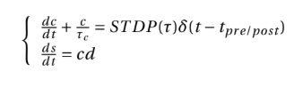
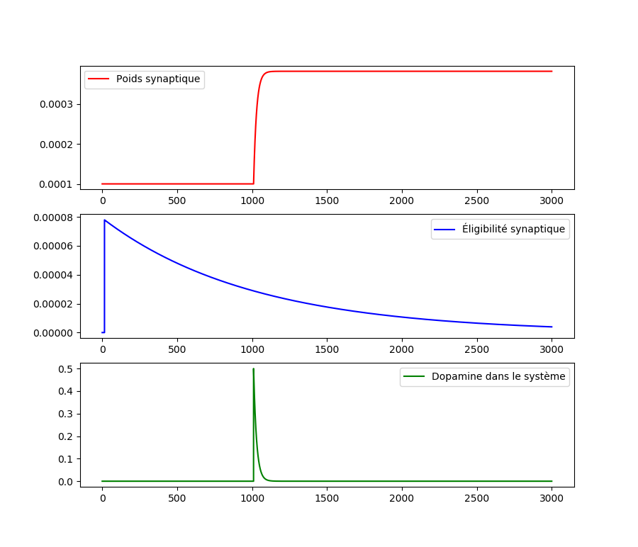
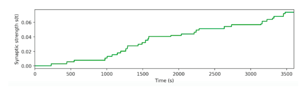
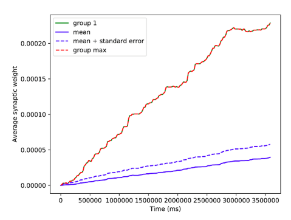

# Brian implementation of Izhikevich's 2007 synapse model
## Model basics
* ```SynapseModel/STDP_Reward```: Brian implementation of Izhikevich's synapse model as described in his 2007 paper (see equation below).



Plots the evolution of the model parameters for a simple two-neuron network:

## Synapse reinforcement
* ```ReinforceSynapse/ReinforceSynapse```: Test of the first experiment in Izhikevich's 2007 paper. In a large network of neurons, release dopamine when the synapse between two given neurons is activated. The goal is to check whether this synapse is selectively reinforced.


## Conditioning
* ```Conditioning/SimpleConditioning```: Test of the second experiment in Izhikevich's 2007 paper. In a network composed of multiple small groups of neurons, release dopamine whenever neurons in the first group spike.


## Future research directions
* ```MultiColumns/GNW```: Architecture for a structured multi-column network in Brian.
* ```XOR/XOR```: Sandbox for the XOR function.
* ```MultiColumns/Digits```: Sandbox for MNIST digits recognition.