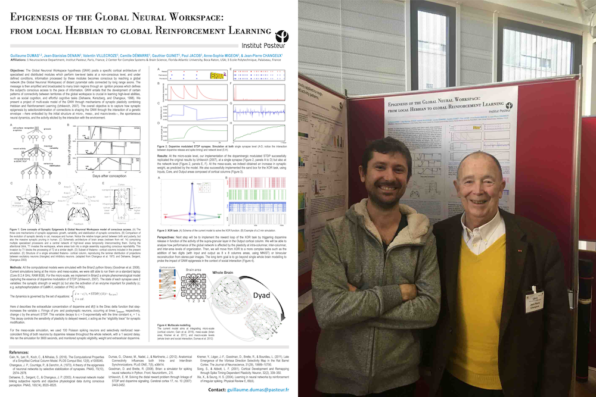

# EpigeneSys

Epigenesis of the Global Neuronal Workspace.

## Multi-Level Development of Cognitive Abilities in an Artificial Neural Network
> Dates: 2018-2022

> Authors: Konstantin Volzhenin, Jean-Pierre Changeux, Guillaume Dumas
 
* [```GNW```](GNW/): Scripts for the final paper reproducing the results of the paper.

## From Local Hebbian to Global Reinforcement Learning
> Dates: 2015-2018

> Authors: Guillaume Dumas, Jean-Stanislas Denain, Valentin Villecroze, Camille Démarre, Gauthier Guinet, Paul Jacob, Anne-Sophie Migeon, Jean-Pierre Changeux

[](Poster_NN_2018.pdf)

Poster presented at the symposium ["Neural networks - from brains to machines and vice versa" on the 11th - 12th October 2018 at the Institut Pasteur, Paris, France](https://research.pasteur.fr/en/event/neural-networks-from-brains-to-machines-and-vice-versa/).

### Implementation in [Brian 2](https://brian2.readthedocs.io/) of the Izhikevich's 2007 synapse model
* [```SynapseModel/STDP_Reward```](SynapseModel/STDP_Reward.ipynb): Brian 2 implementation of Izhikevich's synapse model as described in his 2007 paper (see equation below).


Plots the evolution of the model parameters for a simple two-neuron network:


### Synapse reinforcement
* [```ReinforceSynapse/ReinforceSynapse```](ReinforceSynapse/ReinforceSynapse.ipynb): Test of the first experiment in Izhikevich's 2007 paper. In a large network of neurons, release dopamine when the synapse between two given neurons is activated. The goal is to check whether this synapse is selectively reinforced.


### Conditioning
* [```Conditioning/SimpleConditioning```](Conditioning/SimpleConditioning.ipynb): Test of the second experiment in Izhikevich's 2007 paper. In a network composed of multiple small groups of neurons, release dopamine whenever neurons in the first group spike.


### Other early sandboxes
* [```MultiColumns/GNW```](MultiColumns/GNW.ipynb): Architecture for a structured multi-column network in Brian.
* [```XOR/XOR```](XOR/): Sandbox for the XOR function.
* [```MultiColumns/Digits```](MultiColumns/Digits.ipynb): Sandbox for MNIST digits recognition.
